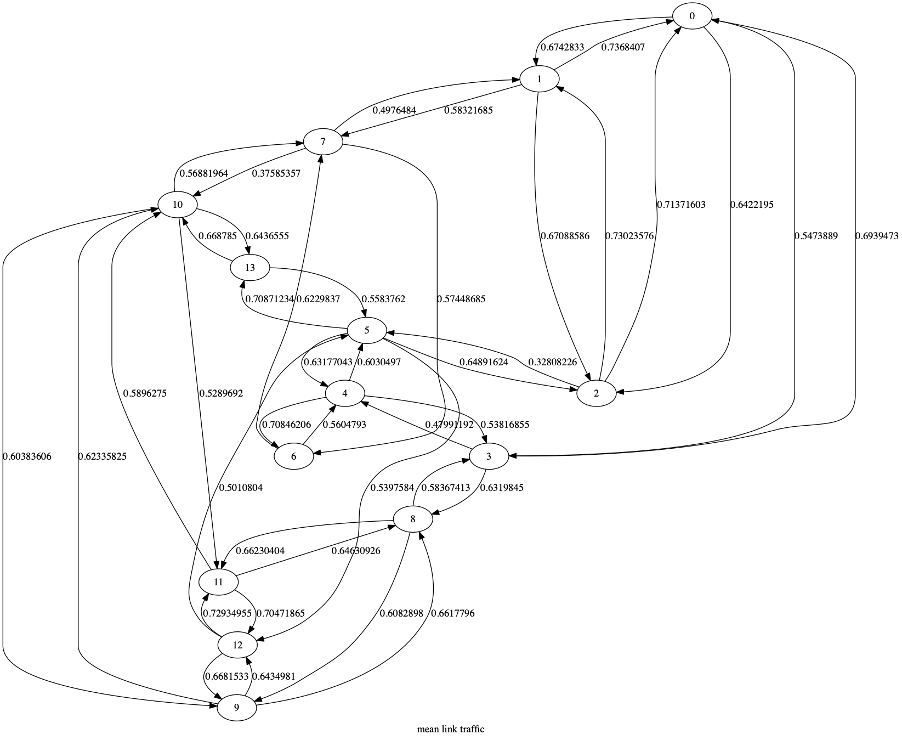

# Explain RouteNet (SOSR'19)

## Prerequisites

### Environment

```
python == 3.7.3
Tensroflow == 1.14
networkx == 2.4
pandas == 1.0.3
python-graphviz == 2.40.1
```

### Dataset & Model

We use the dataset provided by the authors of RouteNet and it can be downloaded following the guideline in 
[RouteNet Github repository](https://github.com/knowledgedefinednetworking/demo-routenet). You may train 
a RouteNet model from scratch and then run our code to interpret it while we also provide the model we train 
and use in the experiments of our paper. We make NO modification on the RouteNet code or settings of the 
model training. A small part of the dataset is included in the `example/` subdirectory as well to help validate 
our code out-of-the-box.


## Interpret Routenet

Execute `run_explain.sh` to run Metis on a randomly selected data sample from the nsfnetbw dataset and the Routenet
model trained on it. Both dataset and model are stored in the `example` subdirectory. After the mask is trained, two graphs are generated to display the sum and mean of the mask in each link separately.



If you want to run Metis on other dataset. You may specify the target dataset(in the format of tfrecord), graph topology of the network in the dataset and the trained model. Currently, we only support the original RouteNet model.